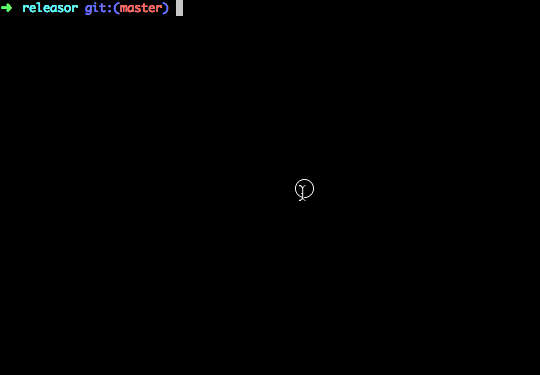

# Releasor

[](https://travis-ci.org/kimmobrunfeldt/releasor)

Command line tool to automate node module releasing to NPM and Git. And of course,
`releasor` has been released with `releasor`. :stew: :dog2:

**Don't** \*

```bash
*bump patch version*
git add package.json
git commit -m "Release *version*"
git push
git tag *version*
git push origin *tag*
npm publish
```

**Do**

```bash
releasor
```

And you will get list of commits since last release conveniently to stdout.
Remember to add release notes to the new GitHub release.

<br>
<br>

\* [npm version](https://docs.npmjs.com/cli/version) actually automates most of
the stuff, but releasor gives some more control to the automation. The point
I'm trying to make is that you shouldn't do a release manually.


## What it does

* Check that branch is `master` Can be disabled with `--no-verify-branch`.
* Output commit messages since last release.
* Bump version number in *package.json*.
* Commit *package.json* to git with a configurable message. Default is `Release {{ version }}`.
* Create a new tag with configurable string. Default is `{{ version }}` without any prefixes.
* Push new tag to remote, usually GitHub.
* Publish module to NPM with `npm publish`.



## Install

```
npm install -g releasor
```


## Usage

```
Usage: releasor [options]

Options:
  --bump              Bump type. Valid values patch, minor, major
                                                     [string] [default: "patch"]
  --dry-run           When set, dry run is done. No commands are actually
                      executed.                       [boolean] [default: false]
  --no-release        When set, only commands which modify local environment
                      will be run. Nothing will be sent to remote environments
                      such as git or NPM. This can be used to test what the
                      script does.                    [boolean] [default: false]
  --no-branch-verify  When set, branch will be not verified to be master
                                                      [boolean] [default: false]
  -m, --message       Message for the new release. Used in git commit.Default: "
                      Release {{ version }}". {{ version }} will be replaced
                      with the new version.
                                     [string] [default: "Release {{ version }}"]
  -t, --tag           Format for the new git tag. Default: "{{ version }}" {{
                      version }} will be replaced with the new version.
                                             [string] [default: "{{ version }}"]
  -h, --help          Show help                                        [boolean]
  -v, --version       Show version number                              [boolean]

Examples:
  releasor
  releasor --bump minor
  releasor --dry-run
  releasor --no-release --bump major
```


## Alternatives

* https://github.com/webpro/release-it
* https://github.com/geddski/grunt-release
* https://github.com/semantic-release/semantic-release


## License

MIT
